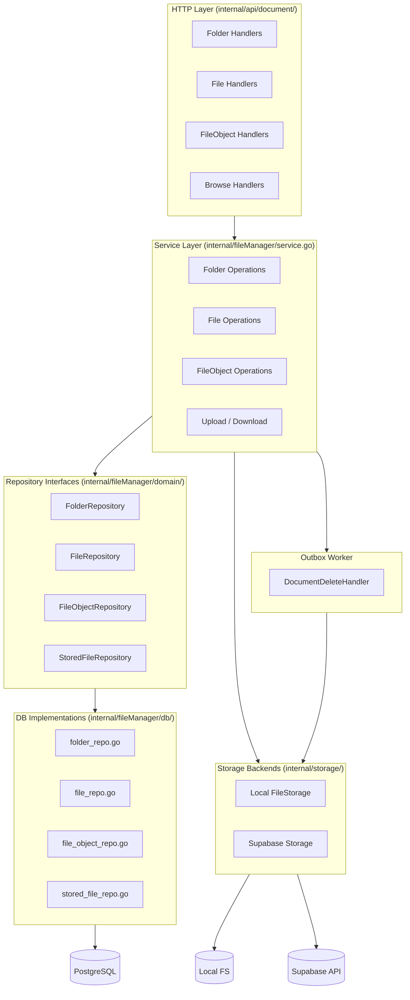
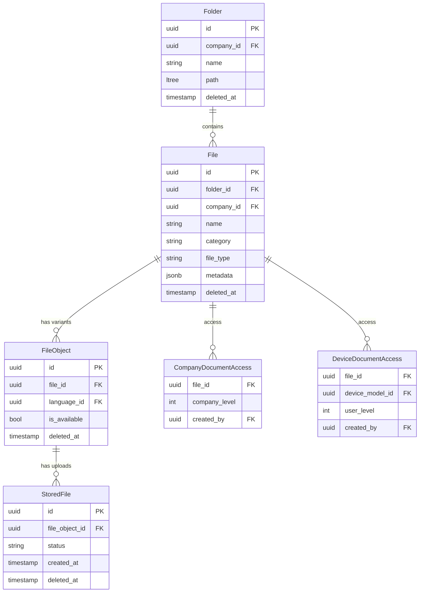
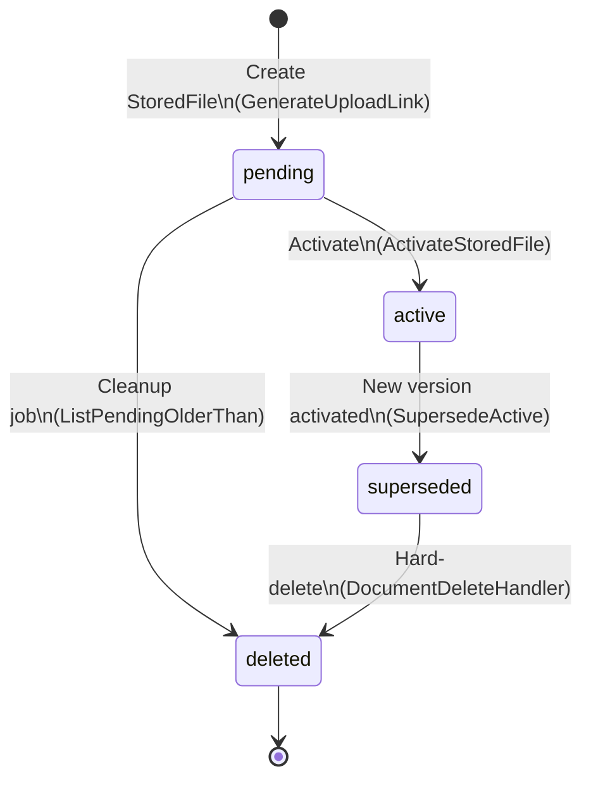
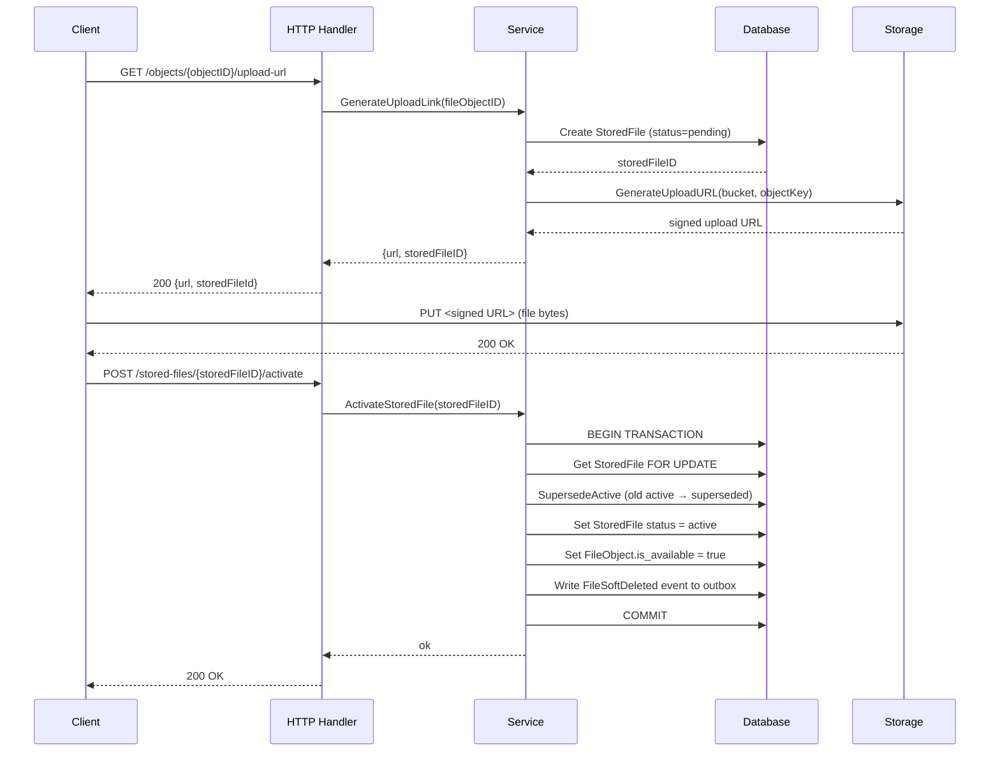

# File Manager

The file manager handles hierarchical document storage: organizing files into folders, managing language variants (FileObjects), tracking physical uploads (StoredFiles), and controlling per-company / per-device access.

---

## Architecture



---

## Core Entities



| Entity | Description |
|--------|-------------|
| **Folder** | Hierarchical container using PostgreSQL `ltree` paths. |
| **File** | Document metadata (name, category, type, JSON metadata). Lives in a folder. |
| **FileObject** | A language variant of a file. One file may have multiple objects for different `language_id` values (plus a `NULL` default). |
| **StoredFile** | A physical upload bound to a FileObject. Tracks status: `pending → active → superseded`. |
| **CompanyDocumentAccess** | Grants access to a file for users at or below a company role level. |
| **DeviceDocumentAccess** | Grants access to a file for a specific device model, gated by user level. |

---

## Interfaces

### `storage.Storage`

Abstracts the file storage backend (local filesystem or Supabase).

```go
type Storage interface {
    GenerateUploadURL(bucket, objectKey string, mimeType *string) (*UploadInfo, error)
    GenerateDownloadURL(bucket, objectKey, filename string, download bool) (*DownloadInfo, error)
    DeleteObject(bucket, objectKey string) error
    ListObjects(bucket, prefix string) ([]string, error)
    GetObjectInfo(bucket, objectKey string) (*ObjectInfo, error)
    FileExists(bucket, objectKey string) bool
}
```

### `domain.FileRepository`

CRUD and listing for File records.

```go
type FileRepository interface {
    Create(ctx, tx, file) (*File, error)
    Get(ctx, id) (*File, error)
    Update(ctx, tx, file) (*File, error)
    SoftDelete(ctx, tx, id) error
    ListInFolderPaged(ctx, folderID, cursor, limit, filter) ([]File, *Cursor, error)
    ListForDevice(ctx, deviceModelID, filter) ([]File, error)
}
```

### `domain.FolderRepository`

Hierarchical folder management backed by `ltree`.

```go
type FolderRepository interface {
    Create(ctx, tx, folder) (*Folder, error)
    Get(ctx, id) (*Folder, error)
    Rename(ctx, tx, id, name) error
    SoftDelete(ctx, tx, id) error
    Move(ctx, tx, id, newParentID) error
    GetSubtree(ctx, id) ([]Folder, error)
    GetAncestors(ctx, id) ([]Folder, error)
    ListChildrenPaged(ctx, parentID, cursor, limit) ([]Folder, *Cursor, error)
}
```

### `domain.FileObjectRepository`

Language variant management.

```go
type FileObjectRepository interface {
    Create(ctx, tx, obj) (*FileObject, error)
    GetByFileAndLanguage(ctx, fileID, languageID) (*FileObject, error)
    GetDefaultByFile(ctx, fileID) (*FileObject, error)
    MarkAvailable(ctx, tx, id) error
    SoftDelete(ctx, tx, id) error
    ListAvailableByFileIDs(ctx, fileIDs) ([]FileObject, error)
}
```

### `domain.StoredFileRepository`

Physical upload lifecycle.

```go
type StoredFileRepository interface {
    Create(ctx, tx, fileObjectID) (*StoredFile, error)
    GetLatestActive(ctx, fileObjectID) (*StoredFile, error)
    SupersedeActiveByFileObject(ctx, tx, fileObjectID) error
    DeleteByFileObject(ctx, tx, fileObjectID) error
    ListPendingOlderThan(ctx, threshold) ([]StoredFile, error)
    Remove(ctx, tx, id) error
}
```

### `domain.AccessFilter`

Injects a SQL `WHERE` clause fragment to scope file queries by company or device access rules.

```go
type AccessFilter interface {
    WhereClause(paramOffset int) (sql string, args []any)
}
```

Two implementations: `CompanyLevelFilter` and `DeviceDocumentFilter`.

---

## Service Functions

All service methods live in `internal/fileManager/service.go`.

### Folder operations

| Function | Description |
|----------|-------------|
| `CreateFolder(ctx, tx, companyID, parentID, name)` | Creates a folder under an optional parent. Uses `ltree` to compute the path. |
| `RenameFolder(ctx, tx, id, name)` | Updates the folder name. |
| `SoftDeleteFolder(ctx, tx, id)` | Marks folder and emits `FolderSoftDeleted` outbox event. |
| `MoveFolder(ctx, tx, id, newParentID)` | Moves folder subtree; detects cycles. |
| `GetFolderBreadcrumbs(ctx, id)` | Returns ancestor chain from root to folder. |

### File operations

| Function | Description |
|----------|-------------|
| `CreateFile(ctx, tx, companyID, folderID, ...)` | Creates a file record in a folder. |
| `GetFile(ctx, id)` | Fetches file with its FileObjects and access records. |
| `UpdateFile(ctx, tx, id, ...)` | Updates metadata fields. |
| `SoftDeleteFile(ctx, tx, id)` | Marks deleted, emits `FileSoftDeleted` outbox event. |
| `MoveFile(ctx, tx, id, newFolderID)` | Moves file to another folder. |

### FileObject operations

| Function | Description |
|----------|-------------|
| `CreateFileObject(ctx, tx, fileID, languageID)` | Adds a language variant to a file. |
| `UpdateFileObject(ctx, tx, id, ...)` | Updates variant metadata. |
| `SoftDeleteFileObject(ctx, tx, id)` | Soft-deletes the variant. |
| `MarkAvailable(ctx, tx, id)` | Sets `is_available = true` after first successful upload. |
| `ListFileObjects(ctx, fileID)` | Returns all non-deleted variants. |

### Upload / Download

| Function | Description |
|----------|-------------|
| `GenerateUploadLink(ctx, fileObjectID)` | Creates a pending `StoredFile` and returns a pre-signed upload URL + `storedFileID`. |
| `ActivateStoredFile(ctx, tx, storedFileID)` | Transitions `pending → active`, supersedes the previous active version, and marks the FileObject as available. |
| `GenerateDownloadLink(ctx, fileObjectID, languageID, download)` | Resolves the correct FileObject (specific language or `NULL` default), fetches the latest active StoredFile, and returns a pre-signed download URL. |

### Browse

| Function | Description |
|----------|-------------|
| `GetFolderContentsPaged(ctx, parentID, filter, folderCursor, fileCursor, limit, nameSearch)` | Returns child folders and files with cursor-based pagination. Fetches `limit+1` items; caller trims the extra to detect the next page. |
| `GetFolderFilesPaged(ctx, folderID, filter, cursor, limit, nameSearch)` | Returns files in a folder only (no subfolders). Same pagination contract as above. |
| `GetDeviceDocuments(ctx, filter)` | Lists all files visible to a specific device model/user-level combination. |

---

## StoredFile State Machine



---

## Upload / Download Flow

### Upload



### Download

1. `GET /objects/{objectID}/download-url?languageId=2&download=true`
2. Service resolves FileObject: looks for `language_id = 2`, falls back to `NULL` (default).
3. Fetches latest active `StoredFile` for that FileObject.
4. Calls `Storage.GenerateDownloadURL` → pre-signed URL.
5. Returns `{url}` to client; client fetches directly from storage.

---

## HTTP Endpoints

Routes are registered by the library handlers (`Handler`, `DownloadHandler`, `BrowseHandler`) on project-supplied routers. The consuming project controls the base path and middleware. See `filemanager-handler.md` for the full route / router matrix.

### Folders

| Method | Path | Description |
|--------|------|-------------|
| `POST` | `/documents/folders` | Create folder |
| `PATCH` | `/documents/folders/{folderID}` | Rename folder |
| `DELETE` | `/documents/folders/{folderID}` | Soft-delete folder |
| `POST` | `/documents/folders/{folderID}/move` | Move folder |
| `GET` | `/documents/folders/{folderID}/ancestors` | Get breadcrumbs |

### Files

| Method | Path | Description |
|--------|------|-------------|
| `POST` | `/documents/files` | Create file |
| `GET` | `/documents/files/{fileID}` | Get file metadata |
| `PATCH` | `/documents/files/{fileID}` | Update file |
| `DELETE` | `/documents/files/{fileID}` | Soft-delete file |
| `POST` | `/documents/files/{fileID}/move` | Move file |
| `GET` | `/documents/files/{fileID}/downloadMeta` | `DownloadHandler` — Get download metadata |
| `GET` | `/documents/files/{fileID}/getUrl` | `DownloadHandler` — Get download URL (resolves best language variant) |

### FileObjects

| Method | Path | Description |
|--------|------|-------------|
| `POST` | `/documents/files/{fileID}/objects` | Create variant |
| `PUT` | `/documents/files/{fileID}/objects/{objectID}` | Update variant |
| `DELETE` | `/documents/files/{fileID}/objects/{objectID}` | Soft-delete variant |
| `GET` | `/documents/files/{fileID}/objects/{objectID}/upload-url` | Get pre-signed upload URL |
| `GET` | `/documents/files/{fileID}/objects/{objectID}/download-url` | `DownloadHandler` — Get pre-signed download URL for a specific variant |
| `POST` | `/documents/files/{fileID}/objects/{objectID}/stored-files/{storedFileID}/activate` | Activate upload |

### Access control

| Method | Path | Description |
|--------|------|-------------|
| `POST` | `/documents/files/{fileID}/access/device` | Grant device access |
| `DELETE` | `/documents/files/{fileID}/access/device` | Revoke device access |

### Browse

| Method | Path | Handler | Description |
|--------|------|---------|-------------|
| `GET` | `{prefix}/documents` | `BrowseHandler` | List root-level folders and files |
| `GET` | `{prefix}/documents/folders/{folderID}` | `BrowseHandler` | List folder contents (folders + files) |
| `GET` | `{prefix}/documents/folders/{folderID}/files` | `BrowseHandler` | List files in a folder only (no subfolders) |
| `GET` | `/devices/{deviceModelID}/documents` | project-defined | List documents for a device model |

---

## Minimal Usage Example

```go
// 1. Wire up the service (done in app.NewApp)
svc := fileManagerService.New(
    folderRepo, fileRepo, fileObjectRepo, storedFileRepo,
    storage,           // storage.Storage implementation
    domainCallbacks,   // outbox writer
    txRunner,
)

// 2. Create a folder
folder, err := svc.CreateFolder(ctx, tx, companyID, nil, "Manuals")

// 3. Create a file in that folder
file, err := svc.CreateFile(ctx, tx, companyID, folder.ID, "Pump Manual", "manual", "pdf", nil)

// 4. Add a default language variant
obj, err := svc.CreateFileObject(ctx, tx, file.ID, nil) // nil = default language

// 5. Get a pre-signed upload URL
uploadResp, err := svc.GenerateUploadLink(ctx, obj.ID)
// → uploadResp.URL: PUT the file bytes here
// → uploadResp.StoredFileID: keep this

// 6. After client upload completes, activate the stored file
err = svc.ActivateStoredFile(ctx, tx, uploadResp.StoredFileID)

// 7. Later: get a download URL
downloadResp, err := svc.GenerateDownloadLink(ctx, obj.ID, nil, true)
// → downloadResp.URL: redirect client here
```

---

## Key Design Decisions

- **`ltree` for folders** — path-based hierarchy enables efficient subtree queries and cycle detection without recursive CTEs.
- **Soft-delete → outbox → hard-delete** — deletes are two-phase: soft-delete emits an event, the background `DocumentDeleteHandler` performs the storage and DB cleanup asynchronously.
- **Superseding strategy** — activating a new upload atomically supersedes the previous active `StoredFile`, maintaining a clear version history.
- **Language fallback** — download resolution tries the requested `language_id` first, then falls back to the `NULL` (default) FileObject.
- **Cursor pagination** — keyset pagination on `(name, id)` avoids the performance pitfalls of `OFFSET`-based pagination on large document lists.
- **AccessFilter injection** — browse queries accept a pluggable `AccessFilter` that appends a SQL fragment, keeping access logic decoupled from query logic.
