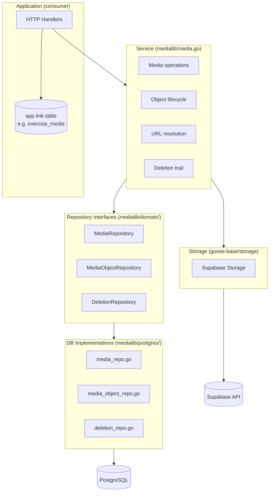
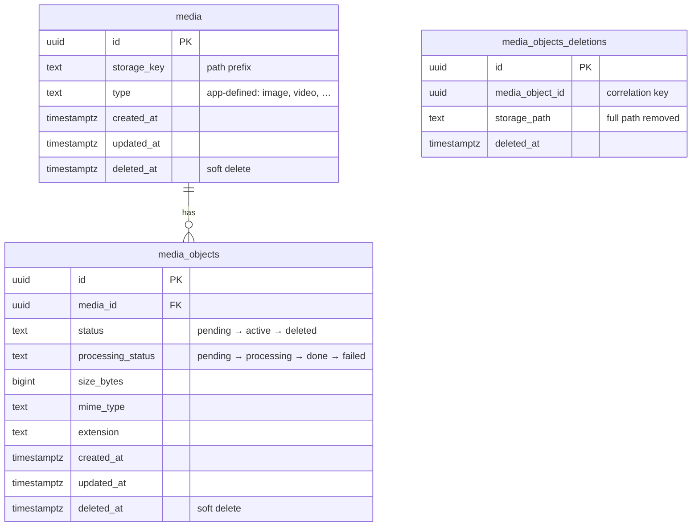
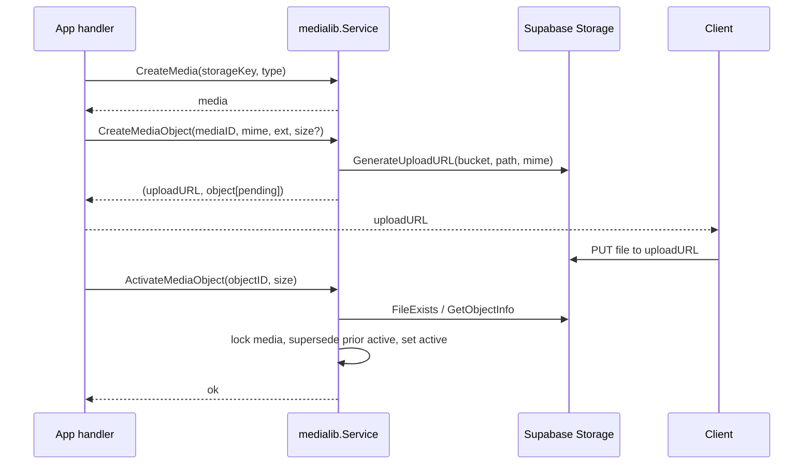

# Media Library (medialib)

`medialib` is a reusable, **entity-agnostic** library for **semi-public** media asset
management. Assets are visible to any logged-in user and identical for all of them.
Storage and on-the-fly image resizing are delegated to **Supabase**; the library owns
the asset lifecycle — upload via presigned URL, re-upload, a single active object per
asset, soft/hard deletion, and a deletion trail for client cache invalidation.

The library is deliberately simpler than `fileManager`: no folders, no language
variants. It knows nothing about the application entities that reference its media —
those links live on app-side tables (e.g. `exercise_media`). See also the package
README (`medialib/README.md`) for bucket/RLS provisioning.

---

## Architecture

The library provides the service + persistence + URL building. The **HTTP layer lives
in the consuming application** (medialib ships no handlers).



---

## Core entities



- **`media`** — the logical asset *slot*. Carries no application meaning (name,
  description, caption): those live on the app link table so the same media can carry
  different captions in different contexts.
- **`media_objects`** — a physical upload. Re-upload = a new object row against the
  same `media_id`. The object's storage URL is derived from its id at runtime.
- **`media_objects_deletions`** — the deletion trail, written on **hard delete** so
  clients can purge cache entries via a pull-after-timestamp query.

---

## Storage layout

The injected `Storage` receives the object key verbatim; the library builds it as:

```
<bucket>/<storage_key>/<media_object_id>/original.<ext>
```

`<ext>` comes from the `extension` supplied at create-upload time (no mime→ext
guessing). An empty `storage_key` on `CreateMedia` defaults to the new media's id, so
each media's objects are uniquely grouped.

---

## Key concepts

### Single active object per media

At most one object per media is `active` at a time. This is enforced two ways:

1. **Application** — activation runs in a transaction that locks the media row
   (`SELECT … FOR UPDATE`), supersedes the prior active object
   (`status = deleted`, `deleted_at = now()`), then activates the new one. The row
   lock serializes concurrent activations on the same media.
2. **Database** — a partial unique index guarantees it regardless of app logic:

   ```sql
   CREATE UNIQUE INDEX media_objects_one_active
       ON media_objects (media_id) WHERE status = 'active' AND deleted_at IS NULL;
   ```

### Access model & URL resolution

Reads are gated by Supabase **RLS** — a single authenticated-read policy on the
bucket, so **any logged-in user may read any object**. There is no per-object
ownership to enforce; the gate is "is there a valid session".

Reads come in two shapes. The difference is only **where the credential lives**.

**1. Header-credentialed — `GetActiveURL` / `ResolveActiveURLs`**

The caller attaches its own Supabase JWT (`Authorization: Bearer …`). This is what
the native/mobile client uses, and the only shape that supports image resizing:

- **image type** → `…/render/image/authenticated/<bucket>/<path>` — no param ⇒
  original; the app appends `?width=<n>` ⇒ a resized, edge-cached image.
- **other type** (video) → `…/object/authenticated/<bucket>/<path>` — `width` does
  not apply; the app uses an image poster for thumbnails.

Which `type` values count as images is configurable via `NewURLBuilder`.

**2. Self-credentialed — `GetActiveSignedURL`**

A signed URL carrying a short-lived token in its query string
(`…/object/sign/<bucket>/<path>?token=…`), so it needs no header at all.

This exists for clients that **cannot** set one — a browser holding its session in
an `HttpOnly` cookie. Supabase's storage API reads the bearer token from the
`Authorization` header **only, never from a cookie**, so the `/authenticated/` URLs
above are simply unreachable from such a client, same-origin or not.

Two consequences beyond the credential:

- **Usable directly as an ``/`<video>` src**, and it supports **range
  requests** — so video seeking works. Fetching an `/authenticated/` URL into a
  `blob:` object URL, the usual workaround, defeats both.
- **No transform.** Supabase applies image transforms at *signing* time and the
  library does not pass one, so a signed URL always returns the original.

Signing uses the **service role key**, which bypasses RLS. That is not an
escalation here: it grants exactly what the authenticated-read policy already
grants every logged-in user. Callers are still expected to have a session of their
own, and the URL is a bearer credential until it expires — keep the expiry short
(the `storage` default is 1 hour) and never log it.

### Processing status (future)

`processing_status` is retained for future server-side **video poster extraction**.
Images need no processing — Supabase resolves sizes on the fly. The field is created
and tracked now; the worker that drives it is out of scope for the initial build.

### Deletion trail & reaping

Hard deletes remove the object from storage, delete the row, and write a deletion-
trail entry (`media_object_id`, `storage_path`, `deleted_at`). Clients call
`GetDeletionsSince(t)` to learn which objects are gone. Soft-deleted / superseded
objects become hard-deletable later; scheduling that reaping is future work.

---

## Upload flow



---

## Public API (`medialib.Service`)

| Method | Behavior |
|---|---|
| `CreateMedia(ctx, storageKey, type)` | Insert a `media` row; empty `storageKey` defaults to the new id. |
| `UpdateMedia(ctx, media)` | Update mutable `media` fields. |
| `SoftDeleteMedia(ctx, id)` | Set `deleted_at` on the media. |
| `HardDeleteMedia(ctx, id)` | Cascade hard-delete the media and its objects (storage removal + trail per object). |
| `CreateMediaObject(ctx, mediaID, mime, ext, size?)` | Create a `pending` object; return a presigned upload URL + the object. |
| `ActivateMediaObject(ctx, objectID, size)` | Verify upload, overwrite size, activate, supersede prior active (locked txn). |
| `HardDeleteMediaObject(ctx, objectID)` | Remove from storage, delete the row, write a deletion-trail entry. |
| `GetActiveURL(ctx, mediaID)` | Fully-built read URL for the active object; the caller supplies the JWT. |
| `ResolveActiveURLs(ctx, mediaIDs)` | Batched type + active read URL for many media in one query. |
| `GetActiveSignedURL(ctx, mediaID)` | Signed read URL for the active object — no header needed, supports range requests, no transform. |
| `GetDeletionsSince(ctx, since)` | Deletion-trail entries newer than `since`. |
| `GetMedia(ctx, id)` | Fetch a media by id (nil when not found). |

### Sentinel errors

`ErrMediaNotFound`, `ErrMediaObjectNotFound`, `ErrObjectNotUploaded` (activation
before the file landed), `ErrNoActiveObject` (no active object for the media).
